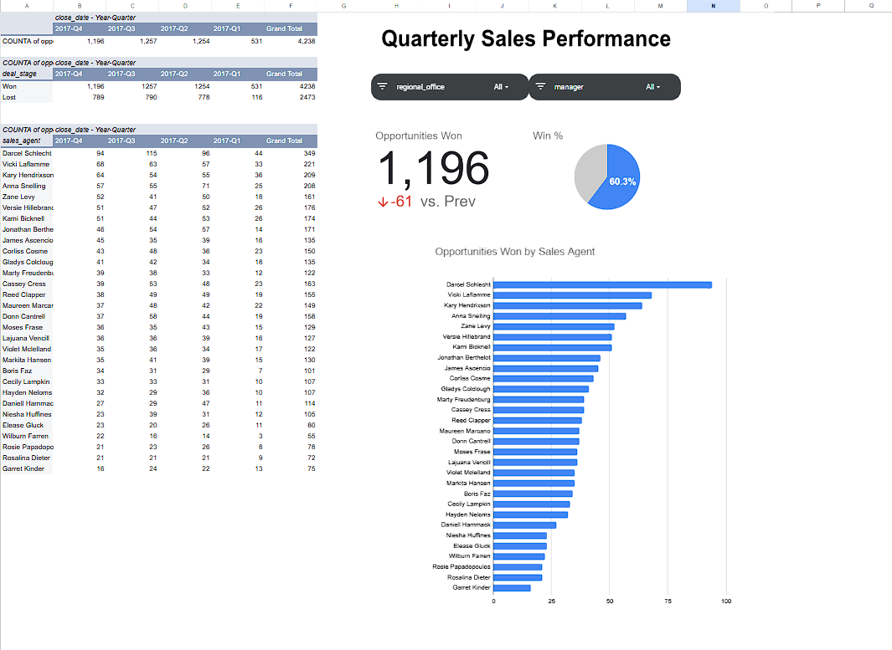

# CRM Sales Opportunities Dashboard

This repository contains a CRM Sales Opportunities Dashboard, designed to help visualize and analyze sales data for effective CRM management.

## Project Overview

This project provides a dashboard for tracking customer accounts, sales opportunities, and sales team performance. It supports data-driven decisions by displaying insights from CRM data in a structured format.

## Files in This Repository

- **accounts.csv**: Contains data on customer accounts, including account names and locations.
- **products.csv**: Lists product details, such as names, categories, and prices.
- **sales_pipeline.csv**: Tracks the sales pipeline, including stages, opportunity sizes, and closing probabilities.
- **sales_teams.csv**: Holds information on sales teams, including IDs and assigned regions.
- **CRM Sales Dashboard.xlsx**: The main Excel file displaying the CRM sales dashboard.
- **Output.png**: A sample image of the dashboard output.

## Features

- **Customer Tracking**: Monitor key accounts and associated data.
- **Product Management**: Access detailed product information.
- **Sales Pipeline Analysis**: Visualize stages, opportunities, and success probabilities.
- **Team Performance**: Review sales team contributions by region or account.

## Getting Started

1. Clone this repository:
   ```bash
   git clone https://github.com/gandharvk422/CRM_Sales_Opportunities_Dashboard.git
   ```
2. Open `CRM Sales Dashboard.xlsx` to view the dashboard with your CRM data.

## Usage

This dashboard can be used to:
- Gain insights into customer relationships.
- Track sales stages and predict closures.
- Evaluate product demand and team efficiency.

## Sample Output



## Contributing

Feel free to submit pull requests to improve data visualization, add more insights, or expand CRM features.

## License

This project is licensed under the MIT License.
```
with open("README.md", "w") as file:
    file.write(readme_content)
```
